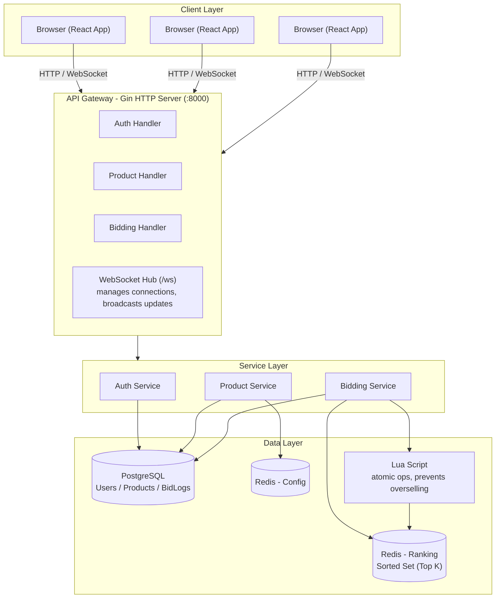

# System Architecture

English | [繁體中文](./ARCHITECTURE.zh-TW.md)

## Architecture Diagram



## Data Flow

### Bidding Flow

```
1. User submits a bid
   ↓
2. Bidding Handler receives the request
   ↓
3. Bidding Service processes it:
   - Reads product config from Redis
   - Computes the score
   - Runs the Lua Script (atomic operation):
     * Checks the auction time window
     * Updates the leaderboard (Sorted Set)
     * Updates the current highest bid
   ↓
4. Asynchronously writes to the database (BidLog)
   ↓
5. WebSocket broadcast:
   - Bid notification
   - Leaderboard update
   ↓
6. Frontend updates the UI in real time
```

### Leaderboard Query Flow

```
1. User requests the leaderboard
   ↓
2. Bidding Handler receives the request
   ↓
3. Bidding Service:
   - Reads the leaderboard from Redis (Sorted Set)
   - Reads product config from Redis (K, current highest bid)
   - Computes the threshold score
   ↓
4. Returns the leaderboard data
```

## Tech Stack

### Backend
- **Language**: Go 1.25
- **Framework**: Gin
- **Database**: PostgreSQL 13
- **Cache**: Redis (Alpine)
- **WebSocket**: gorilla/websocket
- **Auth**: JWT

### Frontend
- **Framework**: React 19.2
- **Language**: TypeScript
- **Build**: Vite 7.2
- **Styling**: Tailwind CSS 3.4
- **Routing**: React Router DOM 7.1

### Infrastructure
- **Containerization**: Docker + Docker Compose
- **Orchestration**: Docker Compose

## Key Design Decisions

### 1. Redis as the Leaderboard Store
- **Why**: needs high-performance sorting and real-time updates
- **Data structure**: Sorted Set (ZSET)
- **Benefit**: O(log N) insert and query, automatically sorted

### 2. Lua Script to Prevent Overselling
- **Why**: guarantees atomic operations and avoids race conditions
- **How**: executed via Redis EvalSha
- **Benefit**: single-threaded execution guarantees consistency

### 3. WebSocket for Real-time Push
- **Why**: reduces polling requests and provides a real-time experience
- **How**: gorilla/websocket Hub pattern
- **Benefit**: low latency, bidirectional communication

### 4. Asynchronous Database Writes
- **Why**: improves response time without affecting user experience
- **How**: writes happen in a goroutine
- **Benefit**: fast responses, eventual consistency

## Scalability Design

### Horizontal Scaling
- **Stateless API**: multiple backend instances can be deployed
- **Redis Cluster**: supported
- **Database read/write splitting**: primary/replica replication can be configured

### Vertical Scaling
- **Resource monitoring**: CPU and memory usage
- **Connection pools**: for the database and Redis
- **Caching strategy**: Redis caches hot data

## Consistency Guarantees

### Strong Consistency
- **Leaderboard updates**: atomic via the Lua Script
- **Quota checks**: the auction time window is checked inside the Lua Script

### Eventual Consistency
- **Database writes**: asynchronous, eventually consistent
- **WebSocket push**: may be delayed, but eventually synced

## Performance Optimizations

### Backend
1. **Redis caching**: leaderboard and product config
2. **Connection pooling**: PostgreSQL connections are pooled (max 600 open / 100 idle, 1-hour max lifetime)
3. **Async processing**: database writes are asynchronous
4. **Lua Script**: reduces network round-trips

### Frontend
1. **WebSocket**: reduces HTTP polling
2. **Lazy loading**: React code splitting
3. **Caching**: product list cached locally

## Monitoring and Logging

### Key Metrics
- **Response time**: p50, p95, p99
- **Error rate**: 4xx/5xx error ratio
- **Throughput**: RPS (Requests Per Second)
- **Concurrent connections**: WebSocket connection count

### Logging
- **Access logs**: Gin's default logging
- **Error logs**: structured error records
- **Performance logs**: timing for key operations

## Security Considerations

### Authentication & Authorization
- **JWT Token**: stateless authentication
- **Role-based access**: Admin/Member permission separation
- **Token expiry**: 24-hour validity

### Data Security
- **Password hashing**: bcrypt
- **SQL injection protection**: GORM parameterized queries
- **XSS protection**: React's automatic escaping

### Known Gap
- **WebSocket CORS**: the HTTP API restricts allowed origins, but the WebSocket upgrader's `CheckOrigin` currently accepts any origin, which bypasses that restriction for `/ws` connections. This should be tightened to the same allow-list before production use.

## Deployment Architecture

### Development
```
Docker Compose
├── Redis (single node)
├── PostgreSQL (single node)
├── Backend (dev mode)
└── Frontend (dev mode)
```

### Production (recommended)
```
Load Balancer
├── Backend Instance 1
├── Backend Instance 2
├── Backend Instance N
│
Redis Cluster
├── Redis Node 1
├── Redis Node 2
└── Redis Node 3
│
PostgreSQL (Primary/Replica)
├── Primary
└── Replica
```
