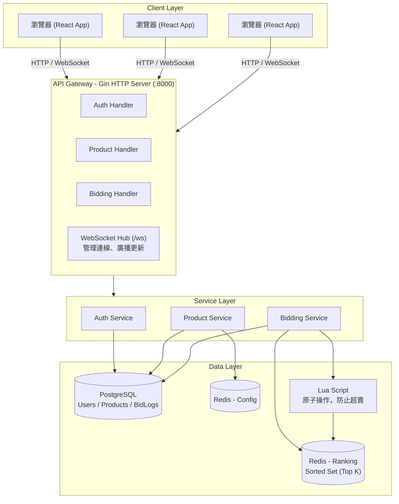

# 系統架構文檔

[English](./ARCHITECTURE.md) | 繁體中文

## 系統架構圖



## 資料流

### 出價流程

```
1. 用戶提交出價
   ↓
2. Bidding Handler 接收請求
   ↓
3. Bidding Service 處理：
   - 從 Redis 讀取商品配置
   - 計算 Score
   - 執行 Lua Script（原子操作）：
     * 檢查活動時間
     * 更新排行榜（Sorted Set）
     * 更新最高價
   ↓
4. 異步寫入資料庫（BidLog）
   ↓
5. WebSocket 廣播：
   - 出價通知
   - 排行榜更新
   ↓
6. 前端即時更新 UI
```

### 排行榜查詢流程

```
1. 用戶請求排行榜
   ↓
2. Bidding Handler 接收請求
   ↓
3. Bidding Service：
   - 從 Redis 讀取排行榜（Sorted Set）
   - 從 Redis 讀取商品配置（K, 最高價）
   - 計算閾值分數
   ↓
4. 返回排行榜資料
```

## 技術棧

### 後端
- **語言**: Go 1.25
- **框架**: Gin
- **資料庫**: PostgreSQL 13
- **快取**: Redis (Alpine)
- **WebSocket**: gorilla/websocket
- **認證**: JWT

### 前端
- **框架**: React 19.2
- **語言**: TypeScript
- **構建**: Vite 7.2
- **樣式**: Tailwind CSS 3.4
- **路由**: React Router DOM 7.1

### 基礎設施
- **容器化**: Docker + Docker Compose
- **編排**: Docker Compose

## 關鍵設計決策

### 1. Redis 作為排行榜存儲
- **原因**: 需要高性能的排序和即時更新
- **資料結構**: Sorted Set (ZSET)
- **優勢**: O(log N) 插入和查詢，自動排序

### 2. Lua Script 防止超賣
- **原因**: 確保原子性操作，避免競態條件
- **實現**: Redis EvalSha 執行 Lua 腳本
- **優勢**: 單線程執行，保證一致性

### 3. WebSocket 即時推送
- **原因**: 減少輪詢請求，提供即時體驗
- **實現**: gorilla/websocket Hub 模式
- **優勢**: 低延遲，雙向通信

### 4. 異步資料庫寫入
- **原因**: 提高響應速度，不影響用戶體驗
- **實現**: Goroutine 異步寫入
- **優勢**: 快速響應，最終一致性

## 擴展性設計

### 水平擴展
- **無狀態 API**: 可以部署多個後端實例
- **Redis 集群**: 支持 Redis Cluster
- **資料庫讀寫分離**: 可以配置主從複製

### 垂直擴展
- **資源監控**: CPU、內存使用率
- **連接池**: 資料庫和 Redis 連接池
- **快取策略**: Redis 快取熱點資料

## 一致性保證

### 強一致性
- **排行榜更新**: Lua Script 原子操作
- **庫存檢查**: Lua Script 中檢查活動時間

### 最終一致性
- **資料庫寫入**: 異步寫入，最終一致
- **WebSocket 推送**: 可能延遲，但最終會同步

## 性能優化

### 後端優化
1. **Redis 快取**: 排行榜和商品配置
2. **連接池**: PostgreSQL 連接使用連接池（最大 600 個連線 / 100 個閒置連線，連線存活時間 1 小時）
3. **異步處理**: 資料庫寫入異步化
4. **Lua Script**: 減少網絡往返

### 前端優化
1. **WebSocket**: 減少 HTTP 輪詢
2. **組件懶加載**: React 代碼分割
3. **快取策略**: 本地快取商品列表

## 監控與日誌

### 關鍵指標
- **響應時間**: p50, p95, p99
- **錯誤率**: 4xx, 5xx 錯誤比例
- **吞吐量**: RPS (Requests Per Second)
- **並發連接**: WebSocket 連接數

### 日誌
- **訪問日誌**: Gin 默認日誌
- **錯誤日誌**: 結構化錯誤記錄
- **性能日誌**: 關鍵操作耗時

## 安全考慮

### 認證與授權
- **JWT Token**: 無狀態認證
- **角色控制**: Admin/Member 權限分離
- **Token 過期**: 24 小時有效期

### 資料安全
- **密碼加密**: bcrypt 雜湊
- **SQL 注入防護**: GORM 參數化查詢
- **XSS 防護**: React 自動轉義

### 已知缺口
- **WebSocket CORS**: HTTP API 已限制允許的來源，但 WebSocket upgrader 的 `CheckOrigin` 目前會接受任何來源，等於繞過了 `/ws` 連線的來源限制。正式環境上線前應收緊為與 HTTP API 相同的白名單。

## 部署架構

### 開發環境
```
Docker Compose
├── Redis (單節點)
├── PostgreSQL (單節點)
├── Backend (開發模式)
└── Frontend (開發模式)
```

### 生產環境（建議）
```
Load Balancer
├── Backend Instance 1
├── Backend Instance 2
├── Backend Instance N
│
Redis Cluster
├── Redis Node 1
├── Redis Node 2
└── Redis Node 3
│
PostgreSQL (主從複製)
├── Primary
└── Replica
```
